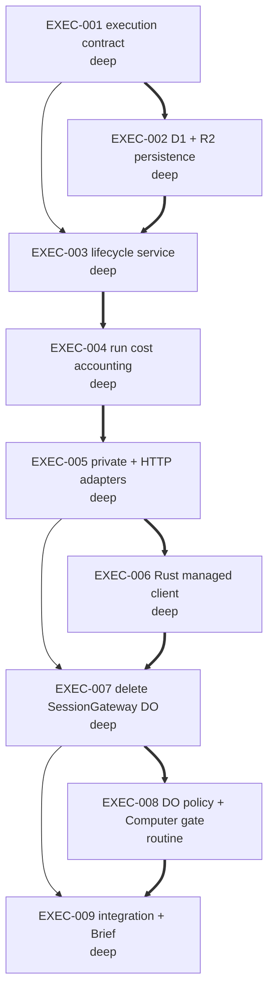

# Plan: Replace Pillbox's custom managed gateway with a bounded execution service

Retain Cloudflare's Sandbox Durable Object only as the container substrate. Move
transport-safe execution claims and terminal references to bounded relational
rows, write one immutable R2 evidence object per completed invocation, and make
Pillbox a single-controller execution service. The historical Huddles RPC shape
remains temporarily as an adapter so the Huddles repository can cut over in its
own deploy; multiplayer sequencing, replay, actors, and driver arbitration leave
Pillbox in this change. Every run also produces a bounded cost envelope and one
aggregate analytics point so usage regressions are visible before the invoice.
The critical path is contract → persistence → service → cost accounting →
adapters → gateway removal → policy/integration.

Cloudflare Computer is deliberately not introduced. The documentation task
records a post-cutover benchmark gate because Computer is preview-only and its
authoritative virtual filesystem is itself backed by Durable Object SQLite.

## EXEC-001 — Freeze the single-controller execution contract

Generalize the existing `pillbox.execution/2` boundary so its result attribution,
status lookup, bounded evidence cursor, conflict behavior, and cancellation shape
describe a runtime execution rather than a Codex- or Huddles-owned session. Keep
request hashing and exact execution-policy validation fail-closed.

```yaml
id: EXEC-001
task_type: refactor
archetype: contract
depth: deep
depends_on: []
footprint:
  modifies:
    - "cloudflare-spike/src/codex_execution.ts::*"
    - "cloudflare-spike/codex_execution.test.ts::*"
produces:
  - "cloudflare-spike/src/codex_execution.ts::ExecuteInvocationV2Request"
  - "cloudflare-spike/src/codex_execution.ts::ExecuteInvocationV2Result"
  - "cloudflare-spike/src/codex_execution.ts::validateExecuteInvocationV2Request"
  - "cloudflare-spike/src/codex_execution.ts::computeInvocationRequestHash"
gate: "cd cloudflare-spike && node --test codex_execution.test.ts"
assumptions:
  - "The wire version remains pillbox.execution/2; incompatible changes require a version bump rather than silently widening v2."
```

## EXEC-002 — Add bounded D1 claims and immutable R2 evidence

Implement ports plus Cloudflare adapters for one low-cardinality execution row
and one immutable evidence/result object. Claims use primary-key point queries,
request-hash conflicts fail closed, running leases are bounded without alarms,
and terminal recovery reads the deterministic R2 key. Tests assert the explicit
per-invocation budget: at most two D1 writes on the happy path, bounded point
reads, and one R2 object write for completed evidence.

```yaml
id: EXEC-002
task_type: feature
archetype: persistence
depth: deep
depends_on: ["EXEC-001"]
footprint:
  modifies: []
  creates:
    - "cloudflare-spike/src/execution_store.ts"
    - "cloudflare-spike/src/execution_artifacts.ts"
    - "cloudflare-spike/execution_store.test.ts"
    - "cloudflare-spike/execution_artifacts.test.ts"
    - "cloudflare-spike/migrations/0001_execution.sql"
produces:
  - "cloudflare-spike/src/execution_store.ts::ExecutionStore"
  - "cloudflare-spike/src/execution_store.ts::D1ExecutionStore"
  - "cloudflare-spike/src/execution_artifacts.ts::ExecutionArtifactStore"
  - "cloudflare-spike/src/execution_artifacts.ts::R2ExecutionArtifactStore"
  - "cloudflare-spike/migrations/0001_execution.sql::execution table"
gate: "cd cloudflare-spike && node --test execution_store.test.ts execution_artifacts.test.ts"
assumptions:
  - "D1 is used only for bounded execution metadata; raw runtime deltas and result bodies never become D1 rows."
  - "A single immutable R2 object can hold the terminal result and bounded execution evidence for the current invocation sizes."
```

## EXEC-003 — Build the execution lifecycle service

Compose the contract, execution store, Sandbox adapter, OpenCode turn driver,
and R2 artifact store into one single-controller lifecycle. Exact retries return
running or the stored terminal result; changed content conflicts; expired or
ambiguous owners terminalize as interrupted and never resample. Runtime deltas
are accumulated into the bounded evidence object rather than inserted as rows.

```yaml
id: EXEC-003
task_type: feature
archetype: backend
depth: deep
depends_on: ["EXEC-001", "EXEC-002"]
footprint:
  modifies: []
  creates:
    - "cloudflare-spike/src/execution_service.ts"
    - "cloudflare-spike/execution_service.test.ts"
produces:
  - "cloudflare-spike/src/execution_service.ts::ExecutionService"
  - "cloudflare-spike/src/execution_service.ts::executeInvocation"
  - "cloudflare-spike/src/execution_service.ts::getExecutionStatus"
gate: "cd cloudflare-spike && node --test execution_service.test.ts"
assumptions:
  - "The current managed executable capability remains OpenCode; unsupported Codex/ACP requests fail explicitly instead of falling back."
  - "The existing five-minute turn bound is shorter than the execution-owner lease, so a valid owner cannot be reclassified while still allowed to run."
```

## EXEC-004 — Add per-run cost accounting and bounded analytics

Define one cross-backend cost envelope whose raw usage units remain
authoritative: model tokens and provider-reported cost, D1 point reads/writes,
R2 operations and bytes, analytics points, and sandbox wall duration plus served
resource profile. Preserve unknowns instead of inventing dollar precision; any
derived dollar amount names a versioned rate card. Persist the exact envelope in
terminal evidence, expose a local `session cost` fold over the ordinary session
log, and give the managed service a best-effort Analytics Engine port that emits
at most one compact point per terminal run. Retry/status reads never emit another
point and analytics failure never changes execution correctness.

```yaml
id: EXEC-004
task_type: feature
archetype: observability
depth: deep
depends_on: ["EXEC-003"]
footprint:
  modifies:
    - "cloudflare-spike/src/contract.ts::Payload"
    - "cloudflare-spike/src/opencode_mapper.ts::*"
    - "cloudflare-spike/src/execution_service.ts::*"
    - "src/contract.rs::Usage"
    - "src/cli.rs::SessionAction"
    - "src/commands/session/mod.rs::*"
  creates:
    - "cloudflare-spike/src/run_cost.ts"
    - "cloudflare-spike/run_cost.test.ts"
    - "src/cost.rs"
produces:
  - "cloudflare-spike/src/run_cost.ts::RunCostEnvelope"
  - "cloudflare-spike/src/run_cost.ts::RunCostMeter"
  - "cloudflare-spike/src/run_cost.ts::RunCostAnalytics"
  - "src/cost.rs::CostSummary"
  - "src/cli.rs::pillbox session cost"
gate: "cd cloudflare-spike && node --test run_cost.test.ts execution_service.test.ts && cd .. && cargo test cost commands::session"
assumptions:
  - "Raw usage units and provider-reported model cost are evidence; infrastructure dollar estimates are advisory and carry a rate-card version."
  - "Analytics Engine receives no prompts, outputs, secrets, repository paths, or participant identity and is capped at one non-blocking point per terminal run."
  - "A missing analytics point is observable but cannot make a completed execution fail; the immutable terminal cost envelope remains the source of truth."
```

## EXEC-005 — Expose private and HTTP execution adapters

Route the private Cloudflare service binding and the managed HTTP client through
the lifecycle service. Preserve the historical `ensureSession`/`invokeSession`
methods only as a compatibility adapter, with Huddles effect fields translated
at the edge rather than stored as collaboration state. Add D1/R2 bindings and
create the isolated preview resources needed to produce real configuration IDs.

```yaml
id: EXEC-005
task_type: feature
archetype: cloudflare
depth: deep
depends_on: ["EXEC-004"]
footprint:
  modifies:
    - "cloudflare-spike/src/huddles_runtime.ts::*"
    - "cloudflare-spike/src/worker.ts::*"
    - "cloudflare-spike/wrangler.toml::*"
    - "cloudflare-spike/wrangler.container.toml::*"
    - "cloudflare-spike/wrangler.ensure-test.toml::*"
  creates:
    - "cloudflare-spike/execution_entrypoint.test.ts"
produces:
  - "cloudflare-spike/src/worker.ts::Env"
  - "cloudflare-spike/src/huddles_runtime.ts::HuddlesRuntimeEntrypoint"
  - "cloudflare-spike/src/worker.ts::single-controller managed HTTP routes"
  - "cloudflare-spike/wrangler.container.toml::one-point-per-run Analytics Engine binding"
gate: "cd cloudflare-spike && node --test execution_entrypoint.test.ts ensure_session.test.mjs && npx wrangler deploy -c wrangler.container.toml --dry-run"
assumptions:
  - "The current signed-in Cloudflare account may create one preview D1 database and one preview R2 bucket; production creation/deployment remains a separate explicit release action."
  - "The compatibility adapter is temporary and does not restore roster, actor, driver, replay, or collaborative sequencing behavior."
```

## EXEC-006 — Move the Rust managed client off the gateway protocol

Replace `/input` plus WebSocket replay with the new execution/status API. Keep
managed foreground execution, workspace restore/finalize, scoped R2 credential
handling, local result-session evidence, and fail-loud unsupported verbs. Remove
the environment-driven managed event sink/source placement so local §0 remains a
local runtime log rather than a remote multiplayer sequence.

```yaml
id: EXEC-006
task_type: refactor
archetype: rust-backend
depth: deep
depends_on: ["EXEC-005"]
footprint:
  modifies:
    - "src/sandbox/managed.rs::*"
    - "src/sandbox/mod.rs::select_backend"
    - "src/sandbox/mod.rs::live_session"
    - "src/events/mod.rs::managed_endpoint"
    - "src/events/sink.rs::*"
    - "src/events/source.rs::*"
produces:
  - "src/sandbox/managed.rs::ManagedBackend"
  - "src/sandbox/managed.rs::ManagedLiveSession"
  - "src/events/sink.rs::local-only event placement"
  - "src/events/source.rs::local-only event placement"
gate: "cargo test sandbox::managed events::sink events::source"
assumptions:
  - "Managed detach/reconnect remains unsupported; this task preserves the currently implemented foreground path only."
  - "Execution evidence downloaded from the managed service can be appended to the ordinary local SessionLog without becoming Huddles collaborative ordering."
```

## EXEC-007 — Delete the custom SessionGateway Durable Object

Remove the Agent/SessionGateway class, multiplayer HTTP/WebSocket routes,
per-event SQLite log, driver state, actor token surface, and Agents SDK
dependency. Update Wrangler migrations so the only Durable Object binding left
is Cloudflare Sandbox. Retain tests for execution idempotency, private access,
workspace transfer, secret redaction, and exact terminal evidence.

```yaml
id: EXEC-007
task_type: refactor
archetype: cloudflare-cleanup
depth: deep
depends_on: ["EXEC-005", "EXEC-006"]
footprint:
  modifies:
    - "cloudflare-spike/src/session_gateway.ts::*"
    - "cloudflare-spike/src/worker.ts::*"
    - "cloudflare-spike/src/auth.ts::*"
    - "cloudflare-spike/package.json::*"
    - "cloudflare-spike/package-lock.json::*"
    - "cloudflare-spike/wrangler.toml::*"
    - "cloudflare-spike/wrangler.container.toml::*"
    - "cloudflare-spike/ensure_session.test.mjs::*"
    - "cloudflare-spike/huddles_invocation.test.ts::*"
produces:
  - "cloudflare-spike/wrangler.container.toml::Sandbox-only Durable Object topology"
gate: "cd cloudflare-spike && npm test && npm run check:contract && npx wrangler deploy -c wrangler.container.toml --dry-run"
assumptions:
  - "Deleting an existing Durable Object class from code/config does not delete its deployed namespace or retained data; production namespace retirement requires a separately reviewed migration after retention/export is decided."
```

## EXEC-008 — Codify DO cost policy and Computer benchmark gate

Turn the ratified cost boundary into concise agent instructions, canonical
architecture documentation, and a source/config regression test. Document that
Cloudflare Computer is evaluated only after the cutover, in an isolated preview
namespace, against rows-read, rows-written, stored bytes, cold-start, task
correctness, and total cost per representative execution; preview status or a
DO-backed VFS cannot silently enter production. The release checklist requires
account budget alerts at low/medium/emergency thresholds and names the manual
GraphQL/provider dashboards used to reconcile application counters with actual
DO, D1, R2, Container, Worker, and Analytics Engine billing.

```yaml
id: EXEC-008
task_type: docs
archetype: governance
depth: routine
depends_on: ["EXEC-007"]
footprint:
  modifies:
    - "AGENTS.md::*"
    - "docs/README.md::*"
    - "docs/managed-tier.md::*"
    - "docs/gateway.md::*"
    - "docs/session-event-log.md::*"
  creates:
    - "docs/durable-object-usage.md"
    - "cloudflare-spike/do_usage_policy.test.mjs"
produces:
  - "docs/durable-object-usage.md::default-deny DO policy and Cloudflare Computer evaluation rubric"
  - "cloudflare-spike/do_usage_policy.test.mjs::DO topology regression gate"
gate: "cd cloudflare-spike && node --test do_usage_policy.test.mjs && cd .. && brief check"
assumptions:
  - "CLAUDE.md is a symlink to AGENTS.md, so changing AGENTS.md updates both agent entrypoints."
```

## EXEC-009 — Integrate, re-pin, and prove the bounded topology

Run the complete TypeScript and Rust gates, re-pin the ratified Brief reference
after verifying the implementation, and record conformance. Verify the diff has
no custom Pillbox Durable Object, no per-delta persistent write, no unbounded
online query, and no accidental production Cloudflare Computer dependency.

```yaml
id: EXEC-009
task_type: test
archetype: integration
depth: deep
depends_on: ["EXEC-007", "EXEC-008"]
footprint:
  modifies:
    - ".brief/SIGNOFF::*"
    - "src/sandbox/managed.rs::*"
    - "PLAN.md::*"
produces:
  - ".brief/SIGNOFF::managed-tier-do-gateway v0002 conformance"
gate: "brief doctor && brief pin && brief check && cargo test && cd cloudflare-spike && npm test && npm run check:contract && npx tsc --noEmit && npx wrangler deploy -c wrangler.container.toml --dry-run"
assumptions:
  - "The repository's full Rust suite is runnable on this macOS/libkrun host without production credentials."
```

## Graph


9 tasks · 1 start immediately · critical path 9
