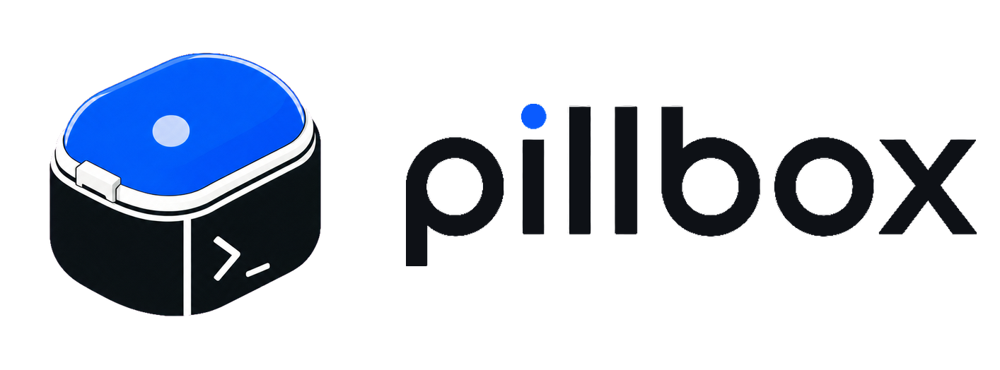

<p align="center">
  <picture>
    <source media="(prefers-color-scheme: dark)" srcset="assets/brand/pillbox-logo-dark.png">
    
  </picture>
</p>

<p align="center"><b>A secure, fast-loading sandbox for coding agents.</b></p>

<p align="center">
  <a href="#what-pillbox-is">What it is</a> &nbsp;·&nbsp;
  <a href="#command-surface">Commands</a> &nbsp;·&nbsp;
  <a href="#build">Build</a> &nbsp;·&nbsp;
  <a href="SECURITY.md">Security</a>
</p>

---

Run `claude`, `codex`,
`opencode`, or `pi` in a hardened container that hands the agent credentials it
can *use but never see* — then put a nice frontend on top, or just drive it
from your terminal.

```sh
pillbox init                          # one-time: create the global pillbox
pillbox auth login --agent claude     # one-time per agent (OAuth in a sandbox)

cd ~/work/my-project
pillbox new --name my-project         # writes pillbox.toml + per-project state
pillbox run                           # sandbox + claude + cwd mounted
```

That's the happy path. The rest of this file is reference.

## What pillbox is

A **local-first** tool. The sauce is on your machine: a coding agent in a fast, hardened sandbox, with credentials it can't leak and a live session you
can build on. No cloud, no account, no platform required.

- **Multi-agent.** One surface over `claude`, `codex`, `opencode`, and `pi`.
  Swap the agent, keep the workflow, the vault, and the session stream.
- **Secure by construction.** The agent runs sandboxed, and the **vault**
  stub-swaps secrets at the egress — the agent sends a key it never sees, so a
  leaked or prompt-injected credential is worthless.
- **A frontend on top, or use it directly.** Every session is a durable, live
  event stream you can drive: `session send` pushes input, `session subscribe`
  streams it to a UI / bot / orchestrator, `session watch` reads it in your
  terminal. Build a frontend on the exact surface you use by hand.
- **Local-only, two backends.** Runs against **libkrun** (a local microVM, the
  default — needs KVM/HVF, on a `--features libkrun` build) or **Docker** (the
  no-KVM compat backend, cross-platform, opt out to it via
  `PILLBOX_BACKEND=docker`). A managed/Cloudflare "remote" tier is in
  progress: its §0-gateway substrate (a per-session Durable Object) is
  proven live on Cloudflare's free tier, but it's not yet a `pillbox run`
  target.

## Why "pillbox-as-bundle"

Coding agents need credentials, state, and a workspace to act on.
Mixing those into one bundle gives you:

- **One mental model.** A pillbox is the thing you create, list, run,
  remove. `claude` / `codex` / `secret` / `env` / `auth` / `vault` are
  not top-level subjects — they're per-pillbox concerns.
- **Project isolation.** Per-project secrets, per-project env bundles,
  per-project vault state, per-project workspace history. One
  project's leases never collide with another's.
- **Shared agent auth.** A single `pillbox auth login --agent claude`
  lives in the global pillbox and is reused across every project.
- **Local-first.** The whole thing runs on your machine with zero cloud
  dependency. A managed/Cloudflare tier for running the same bundle elsewhere
  is in progress (its §0 gateway substrate is validated on Cloudflare — see
  below), but pillbox runs fully local today.

## Where state lives

```
~/.pillbox/                                # 0700
├── global/                                # global pillbox
│   ├── secrets/                           # cross-project secrets (project shadows)
│   ├── env/                               # cross-project env bundles
│   ├── auth/{claude,codex}/               # agent OAuth state (always global today)
│   ├── vault/                             # CA + key for vault sessions
│   └── sessions/                          # detached session records (local Docker / libkrun)
├── projects/
│   └── -Users-vuln-work-foo/              # `/Users/vuln/work/foo` with `/` → `-`
│       ├── meta.json                      # { name, created_at, agent_default, workspace }
│       ├── secrets/                       # overrides global on key conflict
│       ├── env/
│       ├── auth/                          # reserved (per-project auth → v0.7)
│       ├── vault/
│       ├── sessions/                      # sessions started from this pillbox
│       ├── repo-password                  # 0600 — rustic repo encryption password
│       └── repo/                          # local rustic repository (local backend only)
└── cache/                                 # versioned helper scripts
```

The state-dir key is the absolute path of the directory holding
`pillbox.toml`, with `/` replaced by `-`. Human-readable, greppable,
unique per host.

## pillbox.toml

```toml
# Required
name = "my-project"

# Optional — default agent for `pillbox run`
agent = "claude"          # claude | codex | codex-serve | opencode | pi

# Workspace backend (default: local)
[workspace]
backend = "local"         # or "s3"
# s3-only:
# endpoint = "https://<account>.r2.cloudflarestorage.com"
# region = "auto"
# bucket = "my-bucket"
# prefix = "pillbox/"
# access_key_env = "R2_ACCESS_KEY"   # env-var NAME, not the secret value
# secret_key_env = "R2_SECRET_KEY"
```

Discovery walks up from cwd looking for `pillbox.toml` (like
`.gitignore` or `Cargo.toml`). First match wins. Pass `--pillbox NAME`
to bypass discovery and operate on a specific named pillbox.

## Command surface

### Lifecycle

| Command | What it does |
|---|---|
| `pillbox init` | Create the global pillbox at `~/.pillbox/global/`. Idempotent. |
| `pillbox new [--name N] [--agent A] [workspace flags]` | Create a project pillbox in cwd. |
| `pillbox list [--json]` | Every pillbox on disk. |
| `pillbox rm NAME` | Delete a project pillbox by name or key. Refuses `global`. |
| `pillbox info [--json]` | Show the current pillbox. |

### Run + sessions

| Command | What it does |
|---|---|
| `pillbox run [opts] [-- args]` | Launch the agent against the current pillbox (local libkrun microVM by default on a `--features libkrun` build; `PILLBOX_BACKEND=docker` for the no-KVM compat backend). |
| `pillbox run --detach [--label TEXT]` | Start the session in the background; print the reattach id. Works on both local backends. |
| `pillbox session list [--json]` | Sessions started from this pillbox. |
| `pillbox session info ID [--json]` | One session (accepts unique id prefix ≥ 4 chars). |
| `pillbox session attach ID` | Reattach to a detached session. Detach again with **Ctrl-A D**. |
| `pillbox session detach ID` | Signal a currently-attached pillbox to detach (no-op if already detached). |
| `pillbox session send ID TEXT` | **Drive** a detached session — push TEXT to the agent's PTY as if typed (orchestrator / bot / IDE). |
| `pillbox session subscribe ID [--from SEQ]` | **Read (machine):** stream the durable event log over WebSocket, one JSON Event per frame. |
| `pillbox session watch ID [--from SEQ]` | **Read (human):** render the event stream to this terminal — messages, tools, thinking, the attention signal. |
| `pillbox session rm ID` | Tear down the backend (kill sandbox) and remove the record. |

### Secrets / env / auth / vault

| Command | What it does |
|---|---|
| `pillbox secret add/list/show/rm [--global]` | Manage secrets (project default; `--global` writes to global). |
| `pillbox env load/list/show/rm [--global]` | Manage env bundles (same scoping). |
| `pillbox auth login/list/rm --agent A` | Manage agent OAuth state (always global). |
| `pillbox vault ca/status` | Inspect the per-pillbox vault CA. |
| `pillbox sidecar [--bind] [--json]` | Run the credential vault as a standalone process. |

### Workspace

| Command | What it does |
|---|---|
| `pillbox push [--tag T] [--message M] [--json]` | Snapshot cwd into the pillbox's rustic repository. |
| `pillbox pull [--snapshot HANDLE \| --bookmark NAME]` | Restore cwd from a snapshot or bookmark (defaults to latest). |
| `pillbox snapshot list/show/rm` | Manage snapshots in the pillbox's repo. |
| `pillbox bookmark list/show/set/rm` | Manage named bookmarks that point at snapshots. |
| `pillbox workspace rekey` | Rotate the rustic repo encryption password. |

### Other

| Command | What it does |
|---|---|
| `pillbox doctor [--json]` | Diagnose Docker, image, perms, `$HOME`. |
| `pillbox version` | Print pillbox + runner-image versions. |
| `pillbox completions SHELL` | Emit shell completions (`bash`, `zsh`, `fish`, …). |

`--pillbox NAME` is global — works on every per-pillbox command to
override cwd-based discovery.

## Inheritance rules

| What | Read | Write default | `--global` |
|---|---|---|---|
| Secrets | project + global (project wins) | resolved pillbox | force global |
| Env bundles | project + global (project wins) | resolved pillbox | force global |
| Auth | global | global | (implicit; accepted for fwd-compat) |
| Vault | per-pillbox | per-pillbox | n/a |
| Sessions | per-pillbox (no inheritance) | resolved pillbox | n/a |

A project pillbox always sees the global pillbox as a fallback for
secrets / env. Sessions are runtime state and stay tied to the pillbox
that started them.

## Local backends

pillbox runs locally against one of two backends:

- **libkrun** (default on a `--features libkrun` build) — a local microVM
  (macOS/HVF, Linux/KVM); needs KVM/HVF and libkrun installed (plus a codesign
  on macOS). See [docs/libkrun-sandbox.md](docs/libkrun-sandbox.md).
- **Docker** (the no-KVM compat backend, cross-platform; opt out to it via
  `PILLBOX_BACKEND=docker`) — the agent runs in the runner container on your
  local daemon. A build compiled without `--features libkrun` is Docker-only.

Both backends support the full session surface, including detach/reattach.

A managed/Cloudflare **remote** tier — running the same bundle off your
machine — is **in progress**. Its load-bearing piece, the **§0 gateway** (a
per-session Cloudflare Durable Object that holds the event log, assigns `seq`,
attests the actor, arbitrates the driver, and fans out `subscribe`), is built
and **proven live on Cloudflare's free tier**. What remains is running a real
agent in the managed container and wiring `pillbox run` to target it, so it is
not yet a runnable backend. See [docs/managed-tier.md](docs/managed-tier.md) and
`cloudflare-spike/`. It returns with a different shape than the old `--remote`
backends.

## Sessions and the detach hotkey

When you attach to a session (initial run OR `pillbox session
attach`), the local terminal proxies the session's PTY. To detach
**without killing the session**:

- **Ctrl-A then D** — works from the attached terminal.
- `pillbox session detach <id>` — works from any shell.

Either way the session record stays in the registry; the backend
keeps running until `pillbox session rm <id>`. Inside the sandbox,
Ctrl-A Ctrl-A delivers a literal Ctrl-A to the PTY (so readline /
shell beginning-of-line still works).

## Hard reset from v0.5

v0.6 is a deliberate identity reset. There is no migration shim. If
`~/.pillbox/` contains the v0.5 layout (`data/`, `secrets/`, `env/`,
or `vault/` at the top level), v0.6 refuses to run and prints a
pointer like:

```
pillbox: pillbox init failed. detected v0.5 pillbox state (~/.pillbox/data/, …). v0.6 is a hard reset — no migration shim.
  Next: mv ~/.pillbox ~/.pillbox.v0.5-backup && pillbox init
```

Back up, init, re-login. Auth state, secrets, and env bundles do not
carry over.

## Threat model (one screen — see [docs/security.md](./docs/security.md) for the full version)

Pillbox **defends** against:

- An agent reading host environment variables, the user's real
  `~/.claude` / `~/.codex` / `~/.gh`. The sandbox only mounts the
  resolved pillbox's auth dir.
- The login flow contaminating future runs. Login containers are
  one-shot.
- Host tools accidentally consuming pillbox state — everything is
  namespaced under `~/.pillbox/`.
- Workspace data leaking through cloud backends. Rustic encrypts
  on the client; a stolen bucket alone can't be decrypted (password
  is local-only at `<state_dir>/repo-password`).
- Real API keys reaching the agent process. `--vault` routes
  traffic through a stub-swap MITM so leaked API keys are useless.

Pillbox **does not** defend against:

- A prompt-injected agent exfiltrating credentials it was given on
  purpose. `--vault` makes API keys useless but subscription tokens
  are still mountable.
- Stolen unencrypted disk / backups. Files are plaintext at 0600.
  Disk encryption (FileVault / LUKS / BitLocker) is the at-rest
  defense.
- Container escape or kernel attacks on the no-KVM Docker compat backend
  (`PILLBOX_BACKEND=docker`). The default libkrun backend moves execution into a
  microVM with a hardware-isolated boundary; the Docker compat backend shares
  the host kernel, so it is the weaker boundary.

Same posture as `gh`, `aws`, `docker`, `kubectl`. Pillbox is a
sandbox runner, not a secrets manager.

## Status

Pre-alpha. v0.6 is the major reshape (pillbox-as-bundle identity +
sessions), local-only. Roadmap:

- **v0.1–v0.5** ✅ Claude / Codex sandboxing, secrets + env bundles,
  pillbox.toml v1, credential vault (Anthropic + Codex + API keys), CI.
- **v0.6** ✅ `SandboxBackend` trait + sidecar mode; pillbox-as-bundle
  CLI redesign; workspace backends (`rustic_core` — local + S3/R2);
  sessions (list/attach/detach) on the local backends; the **drive/read
  surface** (`session send` / `subscribe` / `watch`) — the interactive
  event substrate, live-verified.
- **libkrun backend** ✅ local microVM, the default on a `--features libkrun`
  build — a secure VM boundary, no daemon, macOS-native; Docker is the no-KVM
  compat fallback (`PILLBOX_BACKEND=docker`)
  ([docs/libkrun-sandbox.md](docs/libkrun-sandbox.md)).
- **§0 managed gateway** 🚧 the §0 substrate as a per-session Cloudflare
  Durable Object (seq authority + actor attestation + driver arbitration +
  `subscribe` fan-out) — **proven live on CF's free tier**
  (`cloudflare-spike/`, [docs/managed-tier.md](docs/managed-tier.md)). Running
  a real agent through it + a `pillbox run` managed backend is the remaining
  slice.
- **v0.7+** that managed/Cloudflare **remote** tier for running the bundle
  off-box.

## Build

```sh
# Pull the canonical runner image (or build your own — see docs/runner-image.md)
docker pull ghcr.io/vu1n/pillbox-runner:latest

# Build + install the CLI
cd ~/code/pillbox && cargo install --path .

# First use
pillbox doctor                          # green?
pillbox init
pillbox auth login --agent claude
cd ~/work/my-project && pillbox new && pillbox run
```

To use a custom image (extra tools, newer harnesses):

```sh
PILLBOX_RUNNER_IMAGE=my-team/pillbox-runner:custom pillbox run
# or pin per-pillbox in pillbox.toml's [runner] table
```

See [docs/runner-image.md](docs/runner-image.md) for the image
contract, build recipe, and how Renovate keeps the harnesses
current.

## Documentation

- [AGENTS.md](./AGENTS.md) — agent-facing command reference (machine-readable)
- [CHANGELOG.md](./CHANGELOG.md) — what shipped, by milestone
- [docs/](./docs/) — topic deep dives
  - [config.md](./docs/config.md) — `pillbox.toml` descriptor + discovery
  - [secrets.md](./docs/secrets.md) — pillbox-scoped secrets + env bundles
  - [vault.md](./docs/vault.md) — per-pillbox credential vault
  - [observability.md](./docs/observability.md) — OTLP telemetry + Workshop integration
  - [shared-mcp.md](./docs/shared-mcp.md) — `--mcp NAME=URL` shared-MCP attachments
  - [runner-image.md](./docs/runner-image.md) — the runner image, overrides, custom builds
  - [recipes.md](./docs/recipes.md) — copy-paste flows
  - [security.md](./docs/security.md) — threat model
- [SECURITY.md](./SECURITY.md) — vulnerability reporting

## License

MIT OR Apache-2.0
