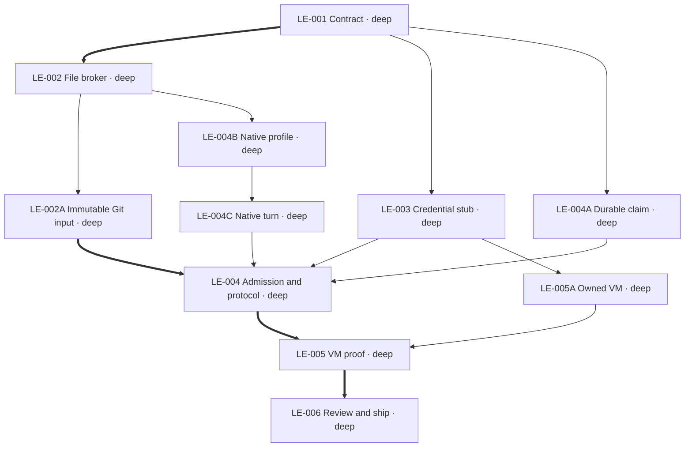

# Plan: bounded local repository execution

Implement Huddles SB-004 on the existing libkrun substrate. Exact file access uses a host-owned
broker with no repository share in the builder VM. Start state: clean main b21252c; isolated branch
codex/local-repository-execution at origin/main 2bc2c3f in /private/tmp/pillbox-local-execution.
Execution/2 and existing sessions retain their behavior. No infrastructure spend or production flip.

## LE-001 — Establish the enforcement contract

```yaml
id: LE-001
status: complete
task_type: docs
depth: deep
depends_on: []
footprint:
  modifies:
    - "docs/local-repository-execution.md::*"
produces:
  - "docs/local-repository-execution.md"
gate: "The document separates runtime policy, exact input, custody and lifecycle, preserves execution/2, and does not claim unfinished enforcement is available."
```

## LE-002 — Implement the exact-file broker

Public interface: `FileTree`, `FileEntry`, `FilePolicy`, `FileBroker`; constructors validate input
and policy; broker read/write/remove enforce independent exact grants and operation grants;
`finish` returns complete immutable base/result digests and changed paths. No filesystem I/O,
model calls, sessions, or credentials in this module. Limits are part of policy and admission.

```yaml
id: LE-002
status: complete
task_type: feature
depth: deep
depends_on: [LE-001]
footprint:
  modifies:
    - "src/execution/files.rs::*"
produces:
  - "src/execution/files.rs::FileBroker"
  - "src/execution/files.rs::FileTree"
  - "src/execution/files.rs::FilePolicy"
gate: "Broker tests prove exact reads/writes/removal, write-only non-disclosure, rejected unsupported paths/tools/secrets, atomic limit failures, deterministic input/result identity, and complete changed paths."
```

## LE-003 — Generate a fresh Codex credential stub

Provide a strict additive helper `fresh_codex_credentials(real, invocation_id)` returning generated
guest JSON and one host-only access-token release pair. Read pinned Codex auth parsing before
choosing synthetic identity fields. Existing legacy helpers keep their contract. No real ID token,
refresh token, unknown field, or copied home enters the guest. Inputs are in memory; caller owns
TokenStore refresh, host binding, and private-file writes.

```yaml
id: LE-003
status: complete
task_type: feature
depth: deep
depends_on: [LE-001]
footprint:
  modifies:
    - "src/vault/providers/codex_execution.rs::*"
produces:
  - "src/vault/providers/codex_execution.rs::fresh_codex_credentials"
gate: "Synthetic tests cover supported pinned auth shape and reject unknown modes/malformed required identity, prove only host access release exists, and prove no real secret/unknown input field appears in guest JSON."
```

## LE-002A — Resolve immutable Git input and capture patches

Read a full Git commit through plumbing commands with replacement objects, ambient config and
lazy network fetch disabled. The first source adapter supports committed regular files only;
it never silently substitutes a dirty working tree. Build the FileTree and validate its digest
before execution. Materialize only into fresh runtime-owned directories, reject case collisions,
and capture a bounded binary-capable patch from exact base/result trees with external diff disabled.

```yaml
id: LE-002A
status: complete
task_type: feature
depth: deep
depends_on: [LE-002]
footprint:
  modifies:
    - "src/execution/snapshot.rs::*"
produces:
  - "src/execution/snapshot.rs::read_git_tree"
  - "src/execution/snapshot.rs::materialize"
  - "src/execution/snapshot.rs::capture_patch"
gate: "Temporary Git repositories prove exact full-commit resolution independent of current checkout, rejected links/submodules/secrets/oversized inputs/case collisions, exact executable/binary restoration, and bounded patches that apply to reproduce the result digest."
```

## LE-004A — Durable invocation ownership

The lifecycle store accepts validated canonical request bytes and an invocation ID, stores the
exact original before returning ownership, and holds a process lock for its entire live lifetime.
Execute is initially foreground; status and cancel use separate bounded CLI calls. A durable
claim can never be reacquired to launch another turn after owner loss. This task needs only the
enforcement contract; concrete manifest validation belongs to LE-004.

```yaml
id: LE-004A
status: complete
task_type: feature
depth: deep
depends_on: [LE-001]
footprint:
  modifies:
    - "src/execution/store.rs::*"
produces:
  - "src/execution/store.rs::InvocationStore"
gate: "Process-lock and durable-state tests prove one owner, identical reuse, changed-content conflict, immutable terminals, idempotent cancellation, and owner-loss recovery to interrupted without reacquisition."
```

## LE-004B — Pin the native tool and model profile

Preserve original Codex 0.151.0 model metadata for the requested sol/terra/luna models as provenance.
Generate effective metadata differing only in `tool_mode: direct`, an explicit supported tool
presentation setting. The exact provider, model, effort and wire route remain unchanged. Every
operation reaches the host broker before execution, allowing a hard total tool-call limit.
Generate a fresh configuration with code mode, environment tools, MCP, skills and extensions disabled.
Use an explicit OpenAI HTTP provider configuration with the same provider identity and exact
requested model. It disables WebSockets; overriding the built-in provider does not work.

```yaml
id: LE-004B
status: complete
task_type: feature
depth: deep
depends_on: [LE-002]
footprint:
  modifies:
    - "src/execution/protocol.rs::*"
    - "src/execution/codex-models-0.151.0.json::*"
produces:
  - "src/execution/protocol.rs::CodexProfile"
gate: "Protocol tests reject fallback/mismatched model and unsupported interactions, preserve exact effort, prove effective catalog differs only in supported direct tool presentation, and register only approved broker functions; live provider acceptance remains mandatory in LE-005."
```

## LE-004C — Execute one bounded native turn

Implement a synchronous, deadline-polled JSON-RPC adapter over the invocation's private stream.
Initialize, validate the exact thread response, start one turn, and dispatch only typed dynamic
file calls through FileBroker. Refuse interactive/approval/unknown server requests, duplicate tool
identities and mismatched terminal identities. Bound frames, total input/output and captured
evidence. Never retry a turn or treat a model-written object as runtime completion.

```yaml
id: LE-004C
task_type: feature
depth: deep
depends_on: [LE-004B]
footprint:
  creates:
    - "src/execution/native.rs"
produces:
  - "src/execution/native.rs::run"
gate: "A fake native peer exercises actual bounded stream I/O: exact configuration, one turn, typed file dispatch, budget failure before mutation, cancellation/deadline, fragmented frames, duplicate calls, unsupported interactions and mismatched completion; no model sampling in this lane."
```

## LE-004 — Bind exact execution and native protocol

Own execution/3 types and admission, CLI, durable lifecycle, exact Codex RPC, and module wiring.
The native protocol has no environment access; generated config disables unrelated extensions.
Exact model/effort/version is checked, provider fallback disabled, unknown input/approval fails.

```yaml
id: LE-004
task_type: feature
depth: deep
depends_on: [LE-002A, LE-003, LE-004A, LE-004C]
footprint:
  modifies:
    - "src/main.rs::*"
    - "src/commands/mod.rs::*"
    - "src/vault/providers/mod.rs::*"
    - "docs/local-repository-execution.md::*"
    - "src/execution/mod.rs::*"
  creates:
    - "src/commands/execution.rs"
produces:
  - "src/execution/mod.rs"
gate: "Admission and native-protocol tests reject changed retry, unsupported policy/configuration, unknown interactions and malformed or uncorrelated terminal data before claiming completion; persisted recovery never starts a second turn."
```

## LE-005 — Integrate local VM and independent verifier

LE-005A supplies the VM process primitive; this integration binds it to the admitted invocation,
the exact result tree and separate verifier evidence. Existing offline grading is not reused:
libkrun must have implicit TSI explicitly disabled, not merely an absent NIC.

```yaml
id: LE-005
task_type: feature
depth: deep
depends_on: [LE-004, LE-005A]
footprint:
  modifies:
    - "src/sandbox/mod.rs::*"
    - "src/sandbox/libkrun/repository.rs::*"
    - "src/execution/mod.rs::*"
    - "src/commands/execution.rs::*"
  creates:
    - "scripts/smoke/repository-execution.sh"
produces:
  - "src/sandbox/libkrun/repository.rs"
gate: "Real isolated local execution proves bounded file/tool/network/credential policy and exact model; identical retry samples once, changed retry conflicts, cancellation is idempotent, crash recovery does not resample, and captured result has positional evidence and separate offline verifier evidence."
assumptions:
  - "Pinned Codex handler registration and transport must support this policy; unsupported capability is a design blocker, not permission to weaken it."
```

## LE-005A — Invocation-owned VM process

Add an isolated builder VM primitive with no repository shares and only generated stub/config
files. Materialize an exact image ID into a separate never-mounted pristine cache and clone for
each invocation. Explicitly disable implicit TSI and use only fenced NIC/plain vsock. A lifetime
channel and deadline must terminate the owned VM on supervisor loss; existing commit guards
disarm too early. Return bounded RPC transport and require explicit successful stop/reap.

```yaml
id: LE-005A
task_type: feature
depth: deep
depends_on: [LE-003]
footprint:
  modifies:
    - "src/sandbox/libkrun/mod.rs::*"
    - "src/sandbox/libkrun/session.rs::*"
    - ".brief/SIGNOFF::*"
  creates:
    - "src/sandbox/libkrun/repository.rs"
produces:
  - "src/sandbox/libkrun/repository.rs::OwnedVm"
  - "src/sandbox/libkrun/repository.rs::launch_builder"
gate: "Tests prove exact image selection without legacy fallback, no repository/auth-home share, explicit plain vsock, bounded bridge I/O, deadline/cancellation/owner-loss termination of only owned processes; real native fork/reparent proof remains required by LE-005."
assumptions:
  - "A private __repository-command guardian lives in repository.rs; LE-004 owns its small main.rs dispatch. It supervises only invocation-owned image helper processes."
```

## LE-006 — Review, ship, and record evidence

Ordering-only dependency on integration: review the settled diff, run Brief check/pin and all
affected CI gates, then merge and verify content equivalence before deleting task-owned branches.

```yaml
id: LE-006
task_type: docs
depth: deep
depends_on: [LE-005]
footprint:
  modifies:
    - ".brief/SIGNOFF::*"
    - "docs/local-repository-execution-PLAN.md::*"
    - "docs/local-repository-execution.md::*"
    - "docs/huddles-codex-execution.md::*"
    - "docs/commands.md::*"
gate: "Tighten and mandatory structure/correctness/security review complete, Brief and required CI green, PR merged, integrated content verified, and actual proof or remaining blocker recorded without claiming SB-004 prematurely."
```

## Graph


