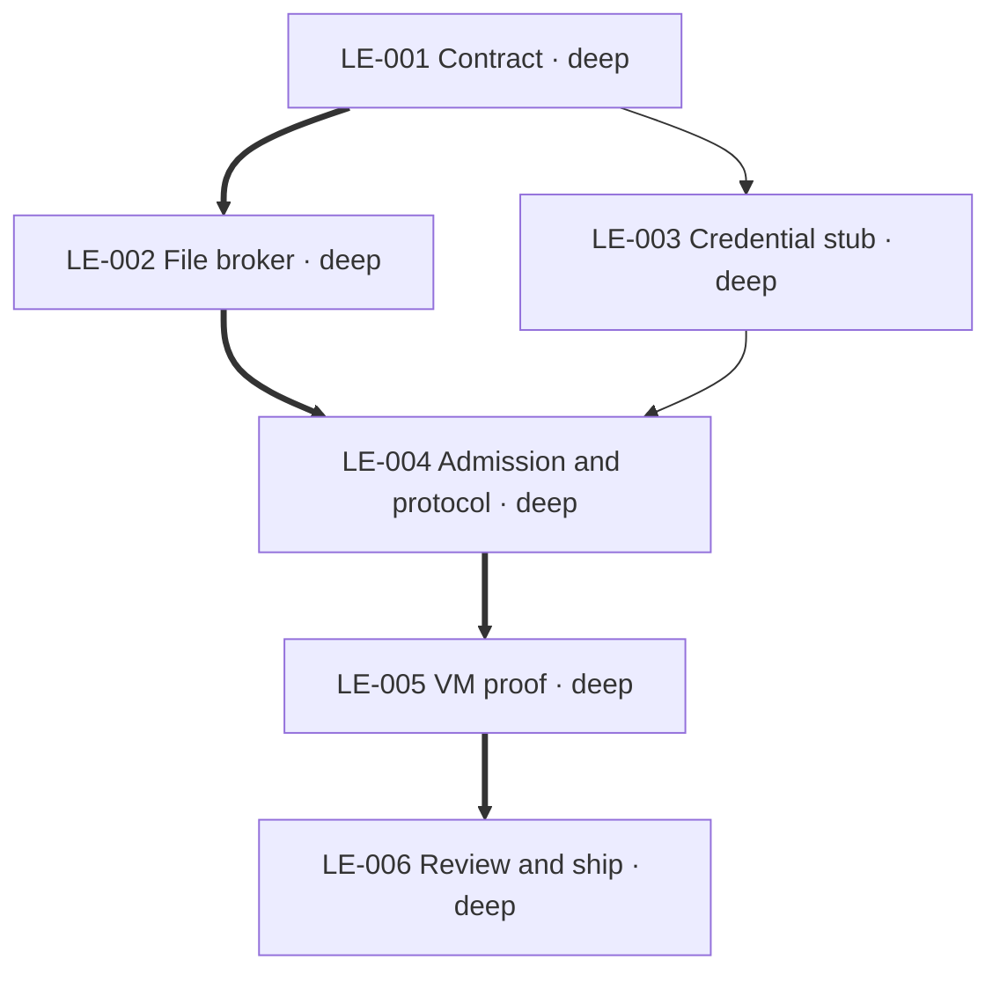

# Plan: bounded local repository execution

Implement Huddles SB-004 on the existing libkrun substrate. Exact file access uses a host-owned
broker with no repository share in the builder VM. Start state: clean main b21252c; isolated branch
codex/local-repository-execution at origin/main 2bc2c3f in /private/tmp/pillbox-local-execution.
Execution/2 and existing sessions retain their behavior. No infrastructure spend or production flip.

## LE-001 — Establish the enforcement contract

```yaml
id: LE-001
status: complete
task_type: docs
depth: deep
depends_on: []
footprint:
  modifies:
    - "docs/local-repository-execution.md::*"
produces:
  - "docs/local-repository-execution.md"
gate: "The document separates runtime policy, exact input, custody and lifecycle, preserves execution/2, and does not claim unfinished enforcement is available."
```

## LE-002 — Implement the exact-file broker

Public interface: `FileTree`, `FileEntry`, `FilePolicy`, `FileBroker`; constructors validate input
and policy; broker read/write/remove enforce independent exact grants and operation grants;
`finish` returns complete immutable base/result digests and changed paths. No filesystem I/O,
model calls, sessions, or credentials in this module. Limits are part of policy and admission.

```yaml
id: LE-002
task_type: feature
depth: deep
depends_on: [LE-001]
footprint:
  creates:
    - "src/execution/files.rs"
produces:
  - "src/execution/files.rs::FileBroker"
  - "src/execution/files.rs::FileTree"
  - "src/execution/files.rs::FilePolicy"
gate: "Broker tests prove exact reads/writes/removal, write-only non-disclosure, rejected unsupported paths/tools/secrets, atomic limit failures, deterministic input/result identity, and complete changed paths."
```

## LE-003 — Generate a fresh Codex credential stub

Provide a strict additive helper `fresh_codex_credentials(real, invocation_id)` returning generated
guest JSON and one host-only access-token release pair. Read pinned Codex auth parsing before
choosing synthetic identity fields. Existing legacy helpers keep their contract. No real ID token,
refresh token, unknown field, or copied home enters the guest. Inputs are in memory; caller owns
TokenStore refresh, host binding, and private-file writes.

```yaml
id: LE-003
task_type: feature
depth: deep
depends_on: [LE-001]
footprint:
  creates:
    - "src/vault/providers/codex_execution.rs"
produces:
  - "src/vault/providers/codex_execution.rs::fresh_codex_credentials"
gate: "Synthetic tests cover supported pinned auth shape and reject unknown modes/malformed required identity, prove only host access release exists, and prove no real secret/unknown input field appears in guest JSON."
```

## LE-004 — Bind exact execution and native protocol

Own execution/3 types and admission, CLI, durable lifecycle, exact Codex RPC, and module wiring.
The native protocol has no environment access; generated config disables unrelated extensions.
Exact model/effort/version is checked, provider fallback disabled, unknown input/approval fails.

```yaml
id: LE-004
task_type: feature
depth: deep
depends_on: [LE-002, LE-003]
footprint:
  modifies:
    - "src/main.rs::*"
    - "src/commands/mod.rs::*"
    - "src/vault/providers/mod.rs::*"
    - "docs/local-repository-execution.md::*"
  creates:
    - "src/execution/mod.rs"
    - "src/execution/protocol.rs"
    - "src/execution/store.rs"
    - "src/commands/execution.rs"
produces:
  - "src/execution/mod.rs"
  - "src/execution/protocol.rs"
gate: "Admission and native-protocol tests reject changed retry, unsupported policy/configuration, unknown interactions and malformed or uncorrelated terminal data before claiming completion; persisted recovery never starts a second turn."
```

## LE-005 — Integrate local VM and independent verifier

```yaml
id: LE-005
task_type: feature
depth: deep
depends_on: [LE-004]
footprint:
  modifies:
    - "src/sandbox/mod.rs::*"
    - "src/sandbox/libkrun/mod.rs::*"
    - "src/execution/mod.rs::*"
    - "src/commands/execution.rs::*"
  creates:
    - "src/sandbox/libkrun/repository.rs"
    - "scripts/smoke/repository-execution.sh"
produces:
  - "src/sandbox/libkrun/repository.rs"
gate: "Real isolated local execution proves bounded file/tool/network/credential policy and exact model; identical retry samples once, changed retry conflicts, cancellation is idempotent, crash recovery does not resample, and captured result has positional evidence and separate offline verifier evidence."
assumptions:
  - "Pinned Codex handler registration and transport must support this policy; unsupported capability is a design blocker, not permission to weaken it."
```

## LE-006 — Review, ship, and record evidence

Ordering-only dependency on integration: review the settled diff, run Brief check/pin and all
affected CI gates, then merge and verify content equivalence before deleting task-owned branches.

```yaml
id: LE-006
task_type: docs
depth: deep
depends_on: [LE-005]
footprint:
  modifies:
    - ".brief/SIGNOFF::*"
    - "docs/local-repository-execution-PLAN.md::*"
    - "docs/local-repository-execution.md::*"
    - "docs/huddles-codex-execution.md::*"
    - "docs/commands.md::*"
gate: "Tighten and mandatory structure/correctness/security review complete, Brief and required CI green, PR merged, integrated content verified, and actual proof or remaining blocker recorded without claiming SB-004 prematurely."
```

## Graph


