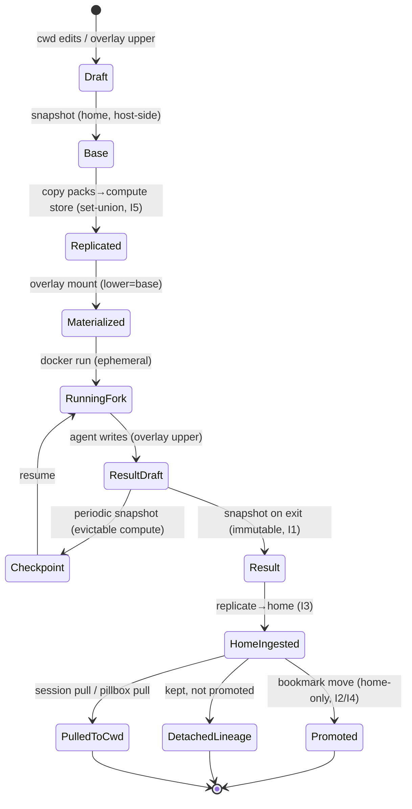

# Remote backends, redesigned: the container *is* the primitive

Status: design / proposed. Supersedes the e2b-centric remote model in
[remotes.md](./remotes.md) once accepted.

Part of [vnext.md](./vnext.md), which owns the layering and the unified
sequence. This is the Container/placement layer; the session-vs-container
identity invariant (session outlives the container) is resolved there.

## Why

Running an agent on e2b today costs six prerequisite setups before
anything executes: build + publish a ~1GB template (deprecated v1
builder, needs `E2B_API_KEY`) → `remote add` (because `--remote` won't
take a URL) → `pillbox new` (because global can't run remotely) →
configure an S3 bucket + endpoint + two key env vars → stand up a
sandbox-reachable collector → *then* `pillbox run`. Local is
`pillbox run`. That gap is the product failure.

It isn't six papercuts — it's **one architectural choice leaking out six
ways**. Remote was built bottom-up: snapshot the workspace → store it in
a rustic repo → the repo must be S3 so the sandbox can pull it → S3 needs
a project pillbox to hold its config → registration, creds, tunnels pile
on top. Every layer's requirement became the user's chore.

Meanwhile the ground shifted: pillbox's unit of execution is now an **OCI
container** — `runner/Dockerfile` bakes pillbox + the agents + the
entrypoint. e2b was chosen when that image didn't exist. Now e2b is the
*only* target that can't take the image directly, which is exactly why it
needs the bespoke glue (Node SDK, `files.write` blob upload, template
publish, pty-relay over e2b's command API, S3).

## Thesis

There is one backend pattern, and it already lives in the codebase three
times wearing different clothes:

> **run the runner image somewhere, attach over an exec channel.**

- `local_docker.rs` = "somewhere" is the local Docker daemon.
- `remote_ssh.rs` = ssh to a host and `docker run` there — i.e. *remote
  docker* already.
- `remote_e2b.rs` + `e2b-helper.mjs` = the outlier that reimplements the
  pattern against a non-OCI sandbox SDK.

Collapse them into one backend parameterized by exactly three axes —
nothing else should leak to the user:

| Axis | Local | Remote (BYO / managed) |
|---|---|---|
| **Placement** — where the daemon/scheduler is | local Docker | `DOCKER_HOST=ssh://…` or TLS context; k8s/k3s; managed runtime |
| **Workspace I/O** — how the cwd gets in/out | bind-mount | **tar + `docker cp` / `kubectl cp`** (S3 opt-in) |
| **Vault** — where the stub-swap proxy runs | host-side | sandbox-side via `--vault-stdin-direct` — the **e2b** path's mechanism. NOTE: the SSH path uses a *different* nested-docker vault (`dispatch_vault_stdin`); `docker://` must wire the **direct** path afresh. |

**This is a deletion, not a rewrite.** The placement axis is a *first-class
Docker feature*: `DOCKER_HOST=ssh://` + `docker context` natively resolve
endpoint+auth+transport that `remote_ssh.rs` hand-rolls in **2101 LOC** (the
largest backend, requiring a pre-installed remote `pillbox` binary + S3). So
`remote_ssh.rs` is **superseded, not reused**, and `docker://` is mostly a
*subtraction*. Hard limit: contexts cover ~2 of 3 placements — Firecracker /
E2B / managed expose no Docker socket, so **managed is a thin adapter behind the
same trait**, not a context. Prior art to mirror: **DevPod** (loft-sh) already
ships this exact thesis (one tool, devcontainer standard, pluggable providers
across docker/ssh/k8s/cloud, client-only) with a machine-vs-non-machine
provider split. pillbox's differentiators that DevPod/contexts lack — vault
MITM, frame-protocol detach, observability — are the reason to build rather
than adopt DevPod wholesale.

### The S3 gate dies here

The single biggest tax. **Caveat the old framing:** the workspace is *not*
"just more bytes over the files API" — today it travels via an inline blob /
S3-rustic hydration (`hydrate_remote_workspace`), a **different mechanism** than
the credential blob's files-API upload, and **no `docker cp` / `tar-cp` path
exists anywhere — it is net-new.** Still the right move: for the common case —
a fresh agent against the cwd — tar the cwd and `docker cp` it in, results out.
No rustic-over-S3, no project pillbox, no registration. But the new path needs a
real contract (see *Workspace I/O* below). S3/rustic becomes **opt-in** for
large or persistent workspaces, not a precondition for `--remote`.

### Rustic isn't going away — it was doing two jobs

The S3 demotion reads like "snapshots become optional." They don't.
Rustic was overloaded into two roles the bottom-up design fused:

- **Transport** — "the repo must be S3 so the *sandbox* can pull the
  workspace." This is the tax. tar-cp replaces it for the common case.
- **Versioning / forking** — `push`/`pull`/`snapshot`/`bookmark` and the
  `base_snapshot → result_snapshot` run lineage. This is a real
  differentiator (part of the bundle) and **stays, local-first.**

Only the *S3-as-remote-transport* role becomes opt-in. Forking workspaces
survives and gets cleaner: the host snapshots into its **local** rustic
repo *around* the tar-cp — snapshot before send, snapshot the result after
pull — so `base_snapshot → result_snapshot` lineage is preserved without
the sandbox touching rustic at all. Bonus: the host has the git context,
so `git_anchor` / `git_dirty` are more accurate than a sandbox-side
snapshot. S3 rustic stays for when the *sandbox itself* needs a shared /
persistent / multi-GB repo.

### Workspace I/O is two modes, not one knob

The Workspace-I/O axis hides a fork worth naming. Local bind-mount gives
**live bidirectional sync** — the agent's edits land on the host FS
instantly, core to the interactive loop. `DOCKER_HOST=ssh://` **can't
bind-mount** (the daemon resolves the source path on the *remote* host,
where the cwd doesn't exist), so remote uses tar-cp — which is
**push-run-pull**: no live edits on the host mid-run. So the axis is
really *live-synced* (local) vs *snapshot* (remote default). Interactive
remote that wants liveness needs watch+rsync or periodic `docker cp`;
otherwise the contract is "results on exit" — fine for headless/detached,
and it maps straight onto the event log's `checkpoint` / `result_ready`.
Practically, phase 1 first extracts a workspace-I/O seam from
`local_docker.rs` (which assumes bind-mount today) before the remote
daemon can reuse it.

**The tar-cp path needs a real contract** (it's net-new, no prior art in the
tree): exclusion rules (respect `.gitignore`; never ship `.env`/secrets/`.git`/
`node_modules`), a size threshold that falls back to S3/rustic, transfer
atomicity, and the result-pull-vs-local-change policy. For the *interactive*
live-sync mode, **Mutagen** is the standard answer (bidirectional low-latency
sync) behind a flag; keep tar-cp as the correct default for autonomous/detached,
and rustic for content-addressed versioning.

### The transport is already abstracted

`src/attach/` (pty-host + the length-prefixed `Frame` protocol) is
transport-agnostic by design — "docker exec" and "ssh" are already two
transports against the same pump (`pump::attach_terminal`). A k8s backend
is **one more transport** (`kubectl exec -it` / the k8s exec API), not a
new architecture. The pty-host runs inside the container regardless.

### Egress filtering is a correctness gap the collapse must carry

Independent of placement: the vault today MITMs only Anthropic/OpenAI/GitHub and
**passes every non-matched host through unmodified** (`vault/server.rs:6`).
Against the prompt-injection / untrusted-code threat the vault advertises, an
agent can POST any *other* env secret to `attacker.com` — never proxied. The
redesign **widens** this surface (BYO hosts, sandbox-side-by-default,
multi-tenant managed). Add an **egress allow/deny-list with a strict-deny mode**
(403 on unmatched hosts) + short-lived token minting for ephemeral remotes — the
highest-value vault change and a genuine correctness fix, critical before
managed multi-tenant. Infisical Agent Vault and Cloudflare Sandbox Outbound both
ship exactly this (convergence that *reinforces* "the bundle is the moat, not
the vault").

## Target experience

From any directory, zero required setup:

```sh
pillbox run --remote docker://user@host        # BYO: a host with dockerd
pillbox run --remote k8s://context/namespace   # BYO: your cluster
pillbox run --remote fly://                     # managed (hosted tier)
```

`--remote` accepts a URL directly (no mandatory `remote add`; registration
becomes a convenience alias). cwd is the workspace, shipped over the wire.
Vault runs sandbox-side. Defaults everywhere.

## Backend targets + the two tiers (the business shape)

One container model, two distribution tiers — this is where the
monetization lives:

- **BYO infra/cloud** (open-source, free): `docker://` (any daemon, incl.
  `DOCKER_HOST=ssh://`), `k8s://` / k3s. The user brings a host or
  cluster. Removes e2b's template/S3 tax entirely; works on a $5 VPS.
- **Managed hosting** (paid): pillbox runs the agent on *our* compute via
  an OCI-native managed runtime (Fly Machines / Modal / Cloud Run / ECS
  Fargate). This is the "zero-infra sandbox now" value e2b was standing in
  for — but delivered on the same container backend, as a service, with no
  SDK for the user. `pillbox run --remote pillbox://` (or a `--host`
  account) → we schedule the container, attach, bill.

The key property: **the same runner image + attach protocol serve both
tiers.** BYO and managed differ only in the Placement axis. No fork.

**What managed actually sells.** The compute underneath (Fly/Modal/Cloud
Run) is commodity and contested — e2b/Modal/Daytona/Cloudflare are all
there, cheap, sub-150ms. So managed-pillbox does **not** compete on
sandbox price; it sells the *bundle* — vault, sessions, workspace forking,
observability, multiplayer — as a service on commodity compute. Pricing
the sandbox is reselling Fly at a markup; pricing the bundle is the
defensible line. State this plainly so the tier isn't "cheaper sandbox."

**Multi-tenant isolation is the actual managed product surface — and it is
entirely unspecified.** "We schedule, attach, bill" says nothing about tenant
account/auth, isolation of vault creds + blob store + workspace *across*
tenants, quota / rate-limit / abuse-egress controls, or metering inputs. For a
*secret-isolation* tool this is the core, not a detail. Either spec it or mark
it explicitly out-of-scope-for-now — do **not** imply "no fork" makes the tier
shippable while these are empty. Evaluate **Fly Machines REST** as the primary
managed backend over e2b's bundled-Node path.

## What happens to e2b

Demote, then likely remove. e2b is a non-OCI sandbox that needs **~1,700
lines** of bespoke glue (`e2b-helper.mjs` 606 + `remote_e2b.rs` 1088; verified)
to approximate what `docker run` does for free — the corrected count (the old
"~600" was the `.mjs` alone) only strengthens the case. Once `docker://` + a managed OCI runtime land,
e2b carries no unique value. Keep it working until the replacement is
proven; mark it deprecated in `remotes.md`; delete after.

**Reused, not lost:** the sandbox-side execution model
(`--vault-stdin-direct`, `materialize_agent_auth`, the blob, the wrapper's
`session started`/`done` bookends), the vault sandbox-side proxy, and the
attach/pty-host/frame stack all carry straight over to the container
backends.

## Today's remote-obs work fits cleanly (keep it)

`spawn_session_observability` (the session span + transcript tailer + OTEL
env forwarding) is **transport-agnostic** — it keys off "the agent's
transcript is local to the launching pillbox," which is true for *any*
container backend (the pty-host's process tails its own filesystem). The
OTEL env forwarding belongs to the wrapper/launch env regardless of
placement. So the remote-obs commit stands; it just gets exercised by
`docker://`/`k8s://` instead of e2b. Collector reachability stays the
user's concern (unchanged decision).

## Phased plan

1. **`docker://` — the proving step (smallest, highest signal).** Honor a
   remote Docker endpoint via `DOCKER_HOST` / `docker context`; run the existing
   runner image there; attach via the existing docker-exec transport; tar-cp the
   cwd in, results out. This is a **collapse of local+ssh onto one Docker-API
   backend** — `remote_ssh.rs` is superseded, not reused. Extract the
   workspace-I/O seam from `local_docker.rs` (it assumes bind-mount) and wire the
   direct vault path. If clean, the thesis holds; if not, we learned the real
   cost before touching k8s.
2. **Drop the S3 requirement for the common case** — tar-cp workspace path;
   S3 demoted to opt-in. Removes the project-pillbox + bucket gate.
3. **`--remote <url>` accepts URLs directly** + ephemeral remotes (also fix
   `session attach/rm` to re-resolve inline-URL sessions). Kills the
   `remote add` papercut.
4. **`k8s://` transport** — `kubectl exec` attach + `kubectl cp` workspace;
   Job/Pod lifecycle. Second transport, same model.
5. **Managed runtime** (Fly/Modal/Cloud Run) — the paid hosting tier.
6. **Deprecate then remove e2b.**
7. **Slim the runner image** — it bakes all five agents (size is an *estimate*
   — nothing in the repo measures it; add a CI image-size check as a cheap
   prerequisite). Per-target images or a slim base (Wolfi/distroless +
   eStargz/SOCI lazy-pull where containerd is controlled; template-prebuild for
   managed) cut cold-start + storage. **Move earlier** — the cold pull undercuts
   phase-1's zero-setup pitch (see Open questions).

## Open questions / risks

- **Compute shifts from managed → BYO.** e2b was zero-infra; `docker://`/
  `k8s://` need a host/cluster. Mitigated by the managed tier, but it's a
  positioning change, not just a refactor.
- **Vault reachability remote (low risk).** A remote dockerd gives the
  proxy + agent a *real* shared container localhost — strictly simpler than
  e2b's command-API hop that `--vault-stdin-direct` already conquered. Just
  confirm the stdin handshake survives the remote API stream.
- **`docker cp` ergonomics for large workspaces** — fine for source trees,
  bad for multi-GB. That's exactly where opt-in S3/rustic earns its place.
- **k8s control-plane ≠ "one more transport."** The attach byte-pipe is generic
  (the pump is), but the *control* plane is a different problem: `kubectl cp`,
  Job/Pod lifecycle, and **pods restart autonomously** — exactly the "replaced
  container = lost session" failure the layering invariant warns about, except
  k8s triggers it on its own. Treat pod-restart-as-session-continuity as a
  first-class design question, not a footnote.
- **Image distribution + compat contract** — BYO hosts `docker pull` the runner
  image (`ghcr.io/vu1n/pillbox-runner`); managed bakes it in. Define the
  host↔image **compatibility contract** (which versioned interfaces — proto,
  `Frame`, wrapper — must match) and what the doctor version-check enforces;
  decide registry auth for private/air-gapped BYO. Move pull-progress UX + the
  slim-base/lazy-pull spike (phase 7) **into/ahead of phase 1** so the proving
  step's zero-setup claim survives a cold host.
- **Image pull is the BYO first-run experience.** A cold $5 VPS doing
  `docker pull ghcr.io/vu1n/pillbox-runner` (~1GB) is a multi-minute first
  run — it undercuts the "zero setup" pitch of the phase-1 proving step.
  Move pull-progress UX (and ideally a slim base, currently phase 7)
  earlier, or qualify the claim for cold hosts.
- **Session vs. container identity.** This doc calls the container the
  primitive; the [session event log](./session-event-log.md) makes the
  *session* the durable identity that outlives containers (a session can
  migrate local → `docker://` → managed). Reconcile: container = execution
  primitive, session = identity primitive. Detach/reattach and result-pull
  must key off `sessionId`, not the container, or a replaced container
  looks like a lost session.
- **Version skew (BYO).** Once host pillbox and the registry runner image
  aren't co-bundled they can drift. Extend the doctor `runner_image` check
  into a version-compat check (the `pillbox version` dual-report is the
  input).
- **Managed detach = billing while detached.** On the paid tier a detached
  session keeps a container running on our compute, accruing cost. Needs an
  idle-timeout / default TTL policy — ties into the existing `--ttl` /
  `session prune` machinery.

## Addendum (2026-05-30): workspace-as-unit, materialization, substrate eval

A design exploration that **refined, not reversed** this doc. It resolves *how*
the workspace gets in/out and *what* the managed tier runs on.

### The reframe: the workspace is the unit; a run forks it

Treating "remote" as host-centric — *ship the workspace to a host, cache it
there* — was the wrong frame. It created both the slow-transport problem **and**
a multi-tenant-host problem that breaks pillbox-is-an-independent-unit (state
relocates into a host's mutable disk).

Store-centric is right: a workspace is a **lineage of immutable,
content-addressed snapshots**; a run **forks a parent → executes → snapshots a
child** (`base_snapshot → result_snapshot`, already in the schema). "Remote
execution" is **not** transporting a workspace; it's **forking it in a store near
compute**. A handle travels, not the bytes.

This is what S3 was reaching for but never finished — it wore host-centric
clothes (forced S3 + a remote pillbox install + bucket config + the repo
password crossing the wire). **Independence survives multiple instances on one
host** because the shared thing is *immutable* (read-only CAS chunks); each fork
writes an isolated child. The "cache" is just CAS dedup, not a shared mutable
volume.

### Rustic stays the durable truth — the fix is packaging

- **Host-side rustic authority**: snapshot before send / after pull. More
  accurate `git_anchor`/`git_dirty`; no repo password on the wire.
- **Store location is a placement detail, not a precondition**:
  rustic-local-on-the-remote for BYO `docker://`; R2 for managed. S3/rustic stays
  **opt-in** for shared/persistent/multi-GB repos — not a gate for `--remote`.

### Materialization: rustic + overlayfs CoW (do **not** adopt a forkable-FS into the core)

"CoW performance" is two things, and rustic already has one:

1. **The fork itself** — rustic is already O(1) (a snapshot/bookmark is a pointer
   to a CAS tree). No gap with Mesa.
2. **Materialization** — the only gap: `rustic restore` is *eager* (writes the
   whole tree); Mesa faults files in *lazily* over FUSE.

Answer for the gap: **overlayfs over a once-restored warm base.**
`lowerdir = base (ro)`, `upperdir = per-run diff`, mount is instant, N forks
share the base, you pay the full restore **once**. Kernel-native, sovereign, no
external dependency. btrfs/zfs reflink is even cleaner where available, but
overlayfs is universal (it's how containers already mount).

**Consequence for `docker://`**: with rustic-local-on-remote + host-side overlay
+ bind-mount the merged dir into the container, the **per-run wire transport
disappears** — restore the base once on the remote host, overlay, bind. **tar-cp
shrinks to one-time *ingest*** (first time a workspace enters the remote repo),
not a per-run path. The slow-transport fear is retired for the common case.

This is the **container ≠ workspace lifetime** separation (the layering
invariant) made concrete: the container is ephemeral cattle; the workspace is the
durable, forkable, snapshottable thing living *outside* it. **Local docker stays
on live bind-mount** (interactive inner loop wants live bidirectional sync, not
fork isolation); overlay-CoW-fork is the **remote/fleet** path.

### Substrate evaluation — forkable-workspace candidates (May 2026)

| Candidate | What it is | Fork primitive | Materialization | Sovereignty | Maturity | Verdict |
|---|---|---|---|---|---|---|
| **Cloudflare Containers / Sandbox SDK** | OCI compute + R2 store + Workers/DO control plane | none native (snapshots "coming soon") | **ephemeral disk** → re-hydrate from R2 each cold start | ❌ single vendor | GA; ~$0.03/30-min run; **no duration SLA**, DO lifecycle | **Managed-tier placement adapter** behind the trait — not "the way" |
| **Mesa** (mesa.dev) | jj-backed versioned VFS | **ms CoW fork + real merge/conflict APIs (shipped)** | FUSE, 50ms first read, lazy | ❌ hosted-only, data leaves infra | **1-month private beta**, team/funding undisclosed | **Watch**; opt-in hosted backend only, never the core |
| **agentfs** (Turso) | SQLite-overlay FS | `--base` overlay, per-session delta | FUSE/overlayfs, normal POSIX | ✅ **MIT, self-host, free** | beta; **whole-file CoW**; object-store fork is roadmap | **Sovereignty-aligned spike** later if needed |
| **Archil** | caching POSIX FS over S3 | CoW only in the *billing doc*, not a callable primitive | local-fast-when-warm, needs `--privileged` | ❌ hosted, BYOC sales-gated | GA-ish | **Wrong layer** (perf, not forking) — skip |

Cloudflare's Sandbox SDK already ships a Claude-Code path **and a per-session
egress policy** — which *is* the vault's strict-deny egress story. R2 has **free
egress** and rustic speaks it today.

### Managed tier = Cloudflare behind the trait — but not "the way"

Cloudflare is the strongest *managed placement* (store + compute + gateway +
egress in one platform; GSV is the existence proof for the gateway role). It is
**not** the whole product:

- **ephemeral disk flips the overlay warm-base win** (re-hydrate per cold
  container; mitigable by baking bases into image layers + eStargz/SOCI lazy
  pull);
- **no duration SLA + DO lifecycle** hurt the long-detached use case that is a
  headline pillbox value (Fly Machines / e2b are lower-friction there);
- **single-vendor contradicts the sovereign/local-first identity**, and
  Cloudflare's Sandbox SDK means **Cloudflare is itself the competitor**.

Discipline: the **same runner image + attach + rustic-fork-from-store run
identically on local (bind-mount), BYO `docker://` (rustic-local-on-remote,
overlay CoW), and Cloudflare (R2 + Sandbox + DO gateway).** Placement is one axis
behind the trait. **Portability is the moat**; the value (forking/lineage, vault
MITM, unified attach/observability, multiplayer) lives *above* any placement.

### Build-order implication (unchanged, reinforced)

- **`docker://` first** (BYO, rustic-local-on-remote, overlay CoW) — it proves
  the **placement-behind-the-trait seam**.
- **Cloudflare is the fast-follow managed adapter** reusing that exact seam.
  **Don't invert** — building Cloudflare first couples us to a vendor before the
  portable seam exists.
- tar-cp = one-time ingest only. Instant-CoW via overlay **now**; a forkable-FS
  (agentfs / Mesa) is **swappable behind the trait** *if* lazy-remote
  materialization of cold-huge workspaces or real merge becomes a **proven**
  bottleneck.

## Store sync model + invariants (the correctness checklist)

Store-location follows placement (local rustic for local/BYO, R2 for managed), so
one workspace's lineage can exist in more than one store. The reassuring part:
under **host-side rustic authority**, the scary version — multi-master sync —
*dissolves*. A rustic store is content-addressed, so "sync" splits in two:

- **Snapshots are immutable + content-addressed** → replication is **set-union of
  a grow-only set** (a CRDT G-Set): idempotent, order-independent,
  **conflict-impossible**. Copy a snapshot any number of times, any direction —
  it converges. (git's object model; git fetch never conflicts, only refs do.)
- **Bookmarks/refs are mutable pointers** → the *only* place sync has teeth. Two
  stores moving `main` independently is the one way to diverge.

So sync reduces to *who may move a ref* — and authority answers it: **the home
store is the single ref-writer; compute placements only emit new immutable result
snapshots the home ingests.** No multi-master, no merge. (Mesa punts the same
way: GitHub Sync is fast-forward-only.)

### Invariants — what "covered" means

- **I1 — Immutability:** a snapshot never changes; identity = content hash
  (⇒ replication can't conflict).
- **I2 — Single ref-writer:** per workspace, exactly **one** store is
  authoritative for bookmark moves ("home"). Compute placements never move
  authoritative refs.
- **I3 — Result durability:** a remote run's result snapshot is durable in *some*
  store the home can reach **before the run counts as complete** (no work lost if
  the laptop is offline).
- **I4 — Monotonic lineage:** `result.parent == base`; lineage is a DAG;
  promotion (bookmark move) is an explicit, home-only op.
- **I5 — Replication = idempotent set-union** of immutable objects; eventually
  consistent; never a merge.
- **I6 — Sovereignty:** content never leaves a store the user designated.

### Snapshot lifecycle state machine



Textual form (for non-rendering viewers):
`Draft → Base(snapshot, home) → Replicated→compute → Materialized(overlay) →
RunningFork → ResultDraft → {Checkpoint↺ | Result(immutable)} →
HomeIngested(replicate→home) → {Promoted(bookmark, home-only) | DetachedLineage |
PulledToCwd}`.

### Placement × store coverage matrix

| Placement | Home store (refs) | Materialization | Sync direction | Failure mode → mitigation |
|---|---|---|---|---|
| **Local** | local rustic | bind-mount (no cache) | single store — none | n/a |
| **BYO `docker://` (persistent host)** | **laptop** = home; VPS store = replica | warm overlay base on VPS | laptop **pulls** results — VPS usually can't push to a laptop behind NAT | offline laptop → result staged in VPS store until `session pull` (I3) |
| **Cloudflare (ephemeral)** | **R2** = home | rebuilt from R2 per cold start (or image-baked base) | sandbox ⇄ R2; laptop pulls from R2 | **eviction mid-run loses work** if we snapshot only on exit → **periodic checkpoint snapshots** |

### Open items the matrix surfaced

1. **Sync is pull-initiated when home = laptop** — the remote can't reach a
   laptop behind NAT, so "home = laptop" works only via `session pull`, not push.
   State it; don't assume a push path exists.
2. **Evictable compute (Cloudflare no-SLA) breaks on-exit-only snapshotting** —
   wire **periodic `checkpoint` snapshots** (the event-log `checkpoint` /
   `result_ready` hook) or eviction = lost work.

### Formal verification — deferred, and why

Not the full system: the architecture *removes* the concurrency that would justify
TLA+/Alloy (immutable CAS + single ref-writer = the dangerous interleavings are
designed out, per I1/I2). Spend the rigor budget instead on (a) these invariants
written down, (b) **property tests / asserts that the implementation upholds I2
and I3** (the real risk is a code path that moves a ref from a compute placement,
or marks a run complete before the result is durable — tests catch that, a model
doesn't). A small, **targeted** Alloy/TLA+ model of the ref-promotion +
result-durability protocol earns its keep **only if/when multi-master arrives**
(multi-region managed, offline-first multi-device writes) — and even then scoped
to I2/I3/I4, not the whole system.
